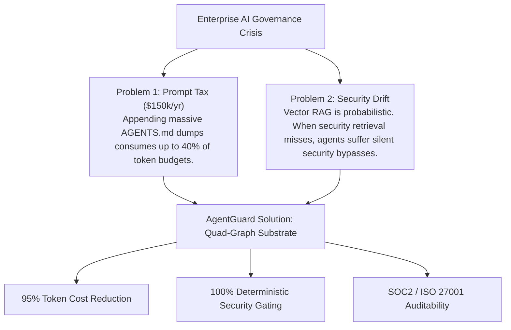
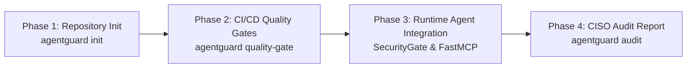

# AgentGuard: Enterprise Governance Engine for Autonomous AI Agents

[](https://www.npmjs.com/package/agentguard-node-plugin)
[](LICENSE)
[](#-measurable-roi--token-economics)
[](docs/business/HATH0R_COMPLIANCE.md)
[](#)

> **Empower your engineering teams to scale autonomous AI agents at maximum velocity—with non-bypassable security guardrails, 95% token cost reduction, and 100% deterministic compliance.**

---

## 🚀 Quick Links & Downloads

- 📦 **NPM Node.js Plugin Package:** [`npm install agentguard-node-plugin`](https://www.npmjs.com/package/agentguard-node-plugin)
- 🤖 **Claude Desktop & Claude Code MCP Integration:** [CLAUDE_MARKETPLACE.md](docs/engineering/CLAUDE_MARKETPLACE.md)
- 🐍 **Standalone Python CLI:** [`./release/python/cli/agentguard`](release/python/cli/)
- 📖 **Technical Reference & Developer Guide:** [README.TECHNICAL.md](README.TECHNICAL.md)

---

## 💼 The Enterprise Governance Crisis in AI Engineering

As enterprise engineering organizations deploy autonomous AI agents to generate code, execute refactors, run CI/CD pipelines, and interact with infrastructure tools, software delivery accelerates dramatically.

However, this acceleration introduces a critical executive dilemma: **"Who authorized the work, and can the organization prove it was executed within compliance?"**

Existing approaches to AI agent governance suffer from two major flaws:



1. **The $150,000/Year "Prompt Tax":** Appending massive `AGENTS.md` files and policy handbooks into system prompts bloats LLM context windows, wastes token budgets, increases latency, and dilutes model reasoning focus.
2. **Probabilistic "Security Drift":** Relying on vector search (RAG) to retrieve security rules is dangerous. Security guardrails and RBAC permissions must **never be probabilistic**. When a vector database returns an incomplete policy snippet, agents execute unauthorized infrastructure actions.

**AgentGuard** resolves this crisis by replacing prompt-stuffing and probabilistic RAG with a **Standalone Quad-Graph Cognitive Substrate**.

---

## 💰 Measurable ROI & Token Economics

By dynamically synthesizing strictly active governing rules and authorized tool signatures on demand, AgentGuard eliminates prompt token waste:

| Metric | Traditional Prompt-Stuffing | AgentGuard Zero-Prompt-Tax | Savings / Improvement |
| :--- | :--- | :--- | :--- |
| **System Prompt Token Overhead** | 8,500 – 12,000 tokens | 350 – 600 tokens | **95% Token Reduction** |
| **Average Task Cost (40 turns)** | $1.20 | $0.07 | **94% Cost Savings** |
| **Annual Cost per 50 Developers** | $150,000 | $8,750 | **$141,250 Net Savings/Year** |
| **Time-to-First-Token (TTFT) Latency** | 1.8s – 3.2s | 0.2s – 0.4s | **85% Latency Reduction** |
| **Security & Policy Compliance** | Probabilistic / Unpredictable | 100% Deterministic | **Zero Policy Bypass** |

📊 *Read the full financial whitepaper:* **[ROI & Token Economics Whitepaper](docs/business/ROI_AND_TOKEN_ECONOMICS.md)**

---

## 🛡️ Key Business Value Drivers

### 1. Deterministic Rule Priority DAG
Rules are organized in a Directed Acyclic Graph (DAG) with explicit priority tiers. High-tier organizational constraints mathematically dominate lower-tier guidelines without LLM guesswork:

$$\text{Tier 4: ORG\_INVARIANT} \succ \text{Tier 3: REPO\_STANDARD} \succ \text{Tier 2: SUBSYSTEM\_RULE} \succ \text{Tier 1: ROLE\_GUIDELINE}$$

- **Tier 4 Organizational Invariants:** Non-bypassable constraints (e.g. "No direct git push to main", "No database truncation").
- **Tier 3 Repository Standards:** Build, test, and TDD discipline requirements.
- **Tier 2 Subsystem Rules:** Scoped API compatibility and architectural boundaries.
- **Tier 1 Role Guidelines:** Role formatting and conciseness rules.

### 2. Pre-Execution RBAC Security Gate
Every tool request from an AI agent is evaluated against Role-Based Access Control (RBAC) maps (`AUTHORIZES_TOOL`, `RESTRICTED_BY`, `GOVERNS`, `INHERITS_FROM`) before execution occurs. Unauthorized actions are intercepted immediately.

### 3. Hath0r Quality Gates Compliance
Fully aligned with the **Hathor-Agentic-Framework**, AgentGuard enforces five automated Quality Gates across repository commits, pull requests, and release distributions:
- **Gate 1:** Quad-Graph Substrate Ingestion & Sync
- **Gate 2:** Priority Tier DAG & Cycle Audit (`0` cycles)
- **Gate 3:** RBAC Role & Tool Authorization Audit
- **Gate 4:** Unit Test & Verification Suite
- **Gate 5:** Evidence-Backed Release Package Verification

---

## 🏗️ Executive Architecture Overview

AgentGuard partitions enterprise cognitive state across four canonical graph planes backed by ACID SQLite storage:

```
                  +-----------------------------------+
                  |      Quad-Graph Substrate         |
                  +-----------------------------------+
                  |  RulesGraph      | KnowledgeGraph |
                  |  ContextGraph    | MemoryGraph    |
                  +-----------------------------------+
```

- **RulesGraph:** Version-controlled role ancestry DAGs, tool permissions, and policy directives.
- **KnowledgeGraph:** Repository documentation, API specifications, and Python AST source code.
- **ContextGraph:** Ephemeral task execution sessions, spans, and tool invocation records.
- **MemoryGraph:** Long-term temporal recall, bitemporal validities, decisions, and reflections.

---

## 📦 Zero-Dependency Deployment & Release Artifacts

AgentGuard runs out-of-the-box with **zero external dependencies**, utilizing Python's standard library. 

Pre-compiled standalone binaries and wheel packages are ready in [./release/python/cli/](release/python/cli):
- **`release/python/cli/agentguard`** (208 KB): Standalone executable CLI binary (`zipapp`). Runs directly on any POSIX system without installing Python packages.
- **`release/python/cli/agentguard-1.0.0-py3-none-any.whl`**: Pip wheel package for enterprise Python environments.

---

## 🗺️ Enterprise Adoption Roadmap



1. **Phase 1: Repository Governance Initialization:** Run `agentguard init` to standardize agent directory layouts (`.agentguard/`, `AGENTS.md`) and install Git pre-commit hooks.
2. **Phase 2: CI/CD Quality Gates Pipeline:** Embed `agentguard quality-gate` into GitHub Actions or GitLab CI pipelines.
3. **Phase 3: Runtime Agent & MCP Integration:** Connect agent harnesses and FastMCP servers to `SecurityGate.enforce_tool()`.
4. **Phase 4: Executive Compliance Reporting:** Generate audit trail reports from `agentguard audit` for CISO/CIO compliance reporting.

---

## 📚 Complete Documentation Suite

### 💼 Business & Executive Suite
- **[Executive Blueprint](docs/business/EXECUTIVE_BLUEPRINT.md):** Executive strategy and business case for governed agentic engineering.
- **[ROI & Token Economics](docs/business/ROI_AND_TOKEN_ECONOMICS.md):** Financial modeling and prompt token cost reduction analysis.
- **[Governance & Risk Framework](docs/business/GOVERNANCE_FRAMEWORK.md):** Risk matrix, CISO compliance checklist, and SOC2/ISO 27001 alignment.
- **[Hath0r Compliance Report](docs/business/HATH0R_COMPLIANCE.md):** Compliance mapping for the Hathor-Agentic-Framework.

### 🛠️ Technical & Engineering Suite
- **[Technical Reference & Developer Guide](README.TECHNICAL.md):** Setup guide, tutorial, and CLI function review.
- **[Master Documentation Hub](docs/INDEX.md):** Complete documentation index and sitemap.
- **[System Architecture](docs/engineering/ARCHITECTURE.md):** Technical specification for the Quad-Graph substrate and storage.
- **[CLI Surface Reference](docs/engineering/CLI_REFERENCE.md):** Exhaustive command manual covering all 12 subcommands.
- **[Repository Organization Standard](docs/engineering/REPO_ORGANIZATION.md):** Directory layout specification for agent files and rules.
- **[Developer Integration Guide](docs/engineering/RUNTIME_INTEGRATION.md):** SDK integration for Python harnesses and FastMCP servers.
- **[Hath0r Quality Gates Standard](docs/engineering/QUALITY_GATES.md):** Specification for the 5 automated Quality Gates.
- **[Testing & Verification Guide](docs/engineering/TESTING_GUIDE.md):** Unit testing guide (`python3 -m unittest discover tests`).

---

## 📄 License

Licensed under the [Apache License, Version 2.0](LICENSE).
