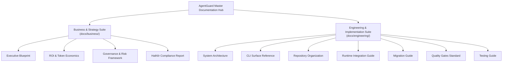

# AgentGuard Master Documentation Hub & Sitemap

> **AgentGuard Standalone Substrate & Governance Engine**  
> **Version:** `1.0.0`  
> **Classification:** Enterprise Documentation Suite  

Welcome to the AgentGuard documentation suite. AgentGuard is a zero-dependency, standalone cognitive substrate and governance control plane for enterprise AI agent systems.

This documentation hub is structured into two main perspectives: **Business & Executive Strategy** and **Engineering & System Implementation**.

---

## 🗺️ Master Sitemap

---

## 💼 Business & Executive Documentation Suite (`docs/business/`)

Designed for C-suite executives, CISOs, VPs of Engineering, and Compliance Directors evaluating or governing autonomous agent deployments.

1. **[Executive Blueprint](business/EXECUTIVE_BLUEPRINT.md)**
   - High-level business case for governed agentic engineering.
   - Analysis of Prompt Tax and Probabilistic Security Drift.
   - Core value drivers: cost reduction, zero policy bypass, and complete auditability.

2. **[ROI & Token Economics](business/ROI_AND_TOKEN_ECONOMICS.md)**
   - Financial analysis comparing traditional prompt-stuffing vs. AgentGuard Zero-Prompt-Tax architecture.
   - Cost reduction calculations (~$140,000/year savings per 50 developers).
   - Time-to-first-token (TTFT) latency improvements.

3. **[Governance & Risk Framework](business/GOVERNANCE_FRAMEWORK.md)**
   - Enterprise risk matrix covering destructive infrastructure actions and credential leakage.
   - The Four-Pillar Governance Model (Priority Tier DAG, Pre-Execution Gate, CI/CD Gate, Audit Ledger).
   - Compliance mapping for SOC2, ISO 27001, PCI-DSS, and HIPAA.

4. **[Hath0r Compliance Report](business/HATH0R_COMPLIANCE.md)**
   - Alignment with the Hathor-Agentic-Framework operating discipline.
   - Proof of compliance mapping across all 5 Hath0r principles.

---

## 🛠️ Engineering & Technical Documentation Suite (`docs/engineering/`)

Designed for Systems Architects, Lead Engineers, Agent Harness Developers, and DevOps/Platform teams building or maintaining agentic software.

1. **[System Architecture](engineering/ARCHITECTURE.md)**
   - Deep-dive technical architecture of the Quad-Graph Cognitive Substrate (`RulesGraph`, `KnowledgeGraph`, `ContextGraph`, `MemoryGraph`).
   - Priority Tier DAG resolution engine ($\text{Tier 4} \succ \text{Tier 3} \succ \text{Tier 2} \succ \text{Tier 1}$).
   - Okapi BM25 lexical search ranking math and SQLite ACID storage spec.

2. **[CLI Surface Reference](engineering/CLI_REFERENCE.md)**
   - Exhaustive command manual covering all 12 subcommands: `init`, `status`, `route`, `query`, `sync`, `validate`, `gate`, `prompt`, `migrate`, `audit`, `bot`, `quality-gate`.
   - Command flags, usage examples, exit codes, and shell automation.

3. **[Repository Organization Standard](engineering/REPO_ORGANIZATION.md)**
   - Standard directory layout specification (`.agentguard/`, `AGENTS.md`, `rules/`, `agents/`, `subsystems/`, `knowledge/`, `memory/`).
   - JSON schemas for config, role manifests, and priority tier rules.

4. **[Developer Runtime Integration Guide](engineering/RUNTIME_INTEGRATION.md)**
   - SDK integration patterns for custom agent harnesses, LLM loops, and FastMCP servers.
   - Code snippets for `SecurityGate.enforce_tool()` and `PromptSynthesizer.synthesize_prompt()`.

5. **Canonical Language-Specific SDK Guides (`docs/engineering/languages/`)**
   - 🐍 **[Python Integration Guide](engineering/languages/PYTHON.md)**: Native in-process `agentguard` package, `AgentGuardGraph`, `SecurityGate`, and FastMCP middleware.
   - 🟨 **[TypeScript / Node.js Integration Guide](engineering/languages/TYPESCRIPT.md)**: TypeScript client wrappers, Vercel AI SDK, and LangChain TS tool middleware.
   - 🔷 **[Go Integration Guide](engineering/languages/GO.md)**: Golang IPC client wrappers and command process execution.
   - ☕ **[Java / Kotlin Integration Guide](engineering/languages/JAVA.md)**: Spring Boot / Spring AI `AgentGuardClient` and ProcessBuilder IPC wrappers.

6. **[Migration Guide](engineering/MIGRATION_GUIDE.md)**
   - Step-by-step transition blueprint for migrating legacy `AGENTS.md`, `.cursorrules`, and vector RAG pipelines to AgentGuard.

7. **[Hath0r Quality Gates Standard](engineering/QUALITY_GATES.md)**
   - Detailed specification of the 5 Quality Gates required for Hath0r-Agentic-Framework compliance.
   - Local CLI execution and GitHub Actions CI/CD pipeline automation.

8. **[Testing & Verification Guide](engineering/TESTING_GUIDE.md)**
   - Comprehensive guide for running, extending, and maintaining unit tests and automated verification pipelines.

---

## 🚀 Quick Navigation Links

- **Main Project README:** [README.md](file:///Users/raybayly/Development/OpenSource/AgentGuard/README.md)
- **Root AGENTS.md Policy:** [AGENTS.md](file:///Users/raybayly/Development/OpenSource/AgentGuard/AGENTS.md)
- **Release Build Folder:** [./release/python/cli/](file:///Users/raybayly/Development/OpenSource/AgentGuard/release/python/cli)
