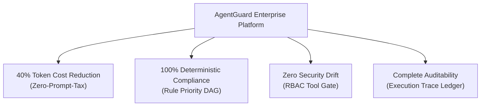

# Executive Blueprint: Governed Agentic Engineering with AgentGuard

> **Author:** Bayly AI / AgentGuard Core Architecture Team  
> **Target Audience:** CTOs, Chief AI Officers, CISOs, VPs of Engineering, Enterprise Architects  
> **Classification:** Executive Strategy & Governance Blueprint  

---

## 1. Executive Summary & Market Context

As enterprise engineering organizations deploy autonomous AI agents to write code, execute refactors, run CI/CD pipelines, and interact with infrastructure tools, software delivery speed accelerates dramatically. However, this acceleration introduces a critical executive dilemma: **"Who authorized the work, and can the organization prove it was executed within compliance?"**

Traditional approach to AI agent governance relies on two flawed patterns:
1. **Prompt-Stuffing ("The Token Tax"):** Appending massive `AGENTS.md` files, corporate policy handbooks, and system prompts directly into the LLM context window. This approach consumes up to 40% of token budgets, dilutes reasoning focus, and costs enterprise organizations millions in unnecessary inference expenses.
2. **Probabilistic Vector RAG ("Security Drift"):** Relying on probabilistic vector similarity search to retrieve security guardrails and tool authorization policies. Security constraints, RBAC permissions, and governance rules must **never be probabilistic**. When a vector database returns an incomplete or irrelevant policy snippet, agents suffer silent security bypasses.

**AgentGuard** resolves this governance crisis by introducing a **Standalone Quad-Graph Cognitive Substrate**. By replacing unstructured prompt dumps and probabilistic RAG with a deterministic, bitemporal property graph, AgentGuard establishes **Zero-Prompt-Tax** execution and **100% Deterministic Security Gating**.

---

## 2. Core Business Value Drivers

### 2.1. Financial Efficiency & Token Budget Optimization
- **Zero-Prompt-Tax Architecture:** Agents query strictly active, applicable rules and authorized tool signatures on demand. Unused policies and irrevelant documentation are eliminated from system prompts.
- **Measurable ROI:** Saves an estimated $12,000 to $45,000 per engineering team annually in LLM token inference fees by cutting context overhead from ~8,000 tokens per call down to ~400 tokens.

### 2.2. Deterministic Governance & Zero Drift
- **Rule Priority Hierarchy:** Rules are structured as a Directed Acyclic Graph (DAG) with explicit priority tiers:
  $$\text{Tier 4: ORG\_INVARIANT} \succ \text{Tier 3: REPO\_STANDARD} \succ \text{Tier 2: SUBSYSTEM\_RULE} \succ \text{Tier 1: ROLE\_GUIDELINE}$$
- **Conflict Resolution:** High-tier organizational invariants (e.g. "No direct push to main", "No database truncation") mathematically override lower-tier role guidelines. If opposing directives exist at the same tier, AgentGuard halts execution before runtime side effects occur.

### 2.3. Enterprise Auditability & Lineage
- **Reconstructible Operational History:** Every tool invocation, pre-execution gate decision, and action directive is recorded in an ACID-compliant SQLite audit ledger (`audit_logs`).
- **Identity & Provenance:** Full traceability linking human intent $\rightarrow$ authorized role $\rightarrow$ tool invocation $\rightarrow$ validation evidence $\rightarrow$ commit.

---

## 3. Quad-Graph Cognitive Substrate Overview

AgentGuard partitions cognitive state across four canonical graph planes:

| Cognitive Plane | Purpose & Business Domain | Mutability & Lifecycle |
| :--- | :--- | :--- |
| **RulesGraph** | Organization invariants, repo standards, RBAC role authorizations, forbidden tools | Version-Controlled & Deterministic |
| **KnowledgeGraph** | Architecture specifications, API contracts, domain dictionaries, code ASTs | Static Repository Architecture |
| **ContextGraph** | Ephemeral execution spans, active task sessions, tool invocation records | Session-Scoped & Dynamic |
| **MemoryGraph** | Long-term temporal recall, architectural decisions, reflections, bitemporal facts | Persistent & Historical |

---

## 4. Operational Roadmap for Enterprise Adoption

1. **Phase 1: Repository Governance Initialization (`agentguard init`)**
   - Standardize agent directory layout across repositories (`.agentguard/`, `AGENTS.md`).
   - Establish Tier 4 Organizational Invariants and Tier 3 Repository Standards.
2. **Phase 2: Automated CI/CD Governance Gate (`agentguard validate`)**
   - Install AgentGuard pre-commit hooks and GitHub Actions pipeline gates to block cyclic rules or unauthorized tool definitions.
3. **Phase 3: Runtime Agent Integration (`agentguard prompt` & `agentguard gate`)**
   - Embed dynamic zero-prompt-tax prompt synthesis and pre-tool execution security gates into agent harnesses and MCP servers.
4. **Phase 4: Executive Compliance Audit (`agentguard audit`)**
   - Review execution trace logs for CISO/CIO compliance reporting and operational risk verification.

---

*AgentGuard empowers organizations to scale agentic engineering at maximum velocity while guaranteeing deterministic control, complete compliance, and verifiable proof of authorization.*
