# Enterprise Governance, Risk & Compliance Framework for AI Agents

> **Author:** Bayly AI / AgentGuard Core Architecture Team  
> **Target Audience:** CISOs, Compliance Officers, Lead Security Architects, Audit Committees  

---

## 1. Enterprise Risk Matrix in Autonomous Workflows

Deploying autonomous AI agents into software delivery pipelines creates five primary compliance and operational risk vectors:

1. **Unauthorized Infrastructure Mutation:** Agents executing destructive shell commands, dropping production database schemas, or modifying S3 bucket permissions.
2. **Credential Exposure:** Unintentional leakage of API keys, tokens, or environment secrets into git commits, chat transcripts, or external LLM API payloads.
3. **Probabilistic Guardrail Bypass:** Security policies being ignored or bypassed because governance directives were retrieved via probabilistic vector search.
4. **Supply Chain & Code Corruption:** Unreviewed agent code commits pushing directly to primary branches without passing unit tests or linter gates.
5. **Lack of Provenance & Non-Repudiation:** Inability to reconstruct which human, agent role, or model decision triggered a critical system failure.

---

## 2. The AgentGuard Governance Model

AgentGuard mitigates these enterprise risks through a **Four-Pillar Governance Architecture**:

```mermaid
flowchart TD
    subgraph Pillar 1: Deterministic Rule Priority DAG
        T4["Tier 4: ORG_INVARIANT (Non-Bypassable)"]
        T3["Tier 3: REPO_STANDARD (Build/Test Discipline)"]
        T2["Tier 2: SUBSYSTEM_RULE (Module Boundaries)"]
        T1["Tier 1: ROLE_GUIDELINE (Formatting/Conciseness)"]
        T4 --> T3 --> T2 --> T1
    end

    subgraph Pillar 2: Pre-Execution RBAC Security Gate
        Gate["SecurityGate.enforce_tool()"]
        Perm["Permitted Tools Check"]
        Forb["Forbidden Tools Lockout"]
        Gate --> Perm
        Gate --> Forb
    end

    subgraph Pillar 3: Continuous CI/CD Audit Gate
        PreCommit["agentguard validate"]
        Cycle["Cycle Detection"]
        Dangling["Dangling Reference Audit"]
        PreCommit --> Cycle
        PreCommit --> Dangling
    end

    subgraph Pillar 4: ACID Execution Trace Ledger
        SQLite["audit_logs Table"]
        Proven["Session & Role Provenance"]
        Reconstruct["Historical Reconstructability"]
        SQLite --> Proven
        SQLite --> Reconstruct
    end
```

---

## 3. Compliance Verification Checklist for CISOs & Auditors

| Governance Requirement | Compliance Standard | AgentGuard Implementation Mechanism |
| :--- | :--- | :--- |
| **Separation of Duties (SoD)** | SOC2 / ISO 27001 | Distinct agent roles (`architect`, `developer`, `reviewer`, `security`) with non-overlapping RBAC tool permissions. |
| **Least Privilege Access** | NIST SP 800-53 | Roles explicitly restrict tools (e.g. `reviewer` role is forbidden from `write_to_file` and `replace_file_content`). |
| **Non-Bypassable Controls** | SOC2 CC6.1 | Tier 4 Organizational Invariants mathematically dominate all lower-tier rules. |
| **Secret Masking & Sanitization** | PCI-DSS / HIPAA | Pre-execution gate blocks raw credential insertion into logs or prompt contexts. |
| **Audit Ledger & Traceability** | HIPAA / FedRAMP | Bitemporal SQLite audit trail logging every tool request, gate evaluation, and decision timestamp. |
| **Immutable Branch Lock** | SOC2 CC8.1 | Pre-commit hook (`.git/hooks/pre-commit`) blocks direct commits to protected branches without PR validation. |
---
