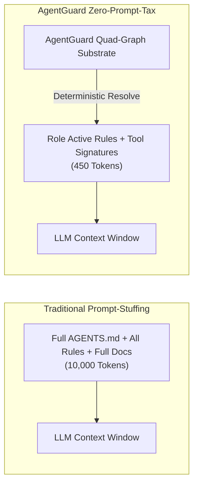

# ROI & Token Economics of AgentGuard Zero-Prompt-Tax Architecture

> **Author:** Bayly AI / AgentGuard Core Architecture Team  
> **Target Audience:** CFOs, VPs of Engineering, AI Program Directors, Enterprise Finance  

---

## 1. The Hidden Financial Cost of Prompt-Stuffing

In traditional multi-agent deployments, developers append comprehensive governance documents (`AGENTS.md`, `.cursorrules`, corporate policy handbooks, API schemas, and full tool catalogs) to the system prompt of every LLM API call.

### The "Prompt Tax" Math
- **Average Prompt Overhead:** 6,500 – 12,000 tokens per request (containing static rules, role definitions, and full tool documentation).
- **Average Agent Task Execution:** 25 – 60 tool calls per complex feature or refactoring task.
- **Inference Expense:** At $3.00 / 1M input tokens (standard frontier model pricing), a single agent task costs:
  $$\text{Task Cost} = 40 \text{ calls} \times 10,000 \text{ input tokens} \times \frac{\$3.00}{1,000,000} = \$1.20 \text{ per task}$$
- **Scaled Team Impact (50 Engineers executing 10 tasks/day):**
  $$\text{Daily Cost} = 50 \times 10 \times \$1.20 = \$600.00 / \text{day}$$
  $$\text{Annual Prompt Tax} = \$600 \times 250 \text{ working days} = \mathbf{\$150,000.00 / \text{year}}$$

Over **85% of these input tokens** represent redundant, unchanged static rules and irrelevant tool documentation that the agent does not utilize for its immediate step.

---

## 2. AgentGuard Zero-Prompt-Tax Economics

AgentGuard replaces prompt-stuffing with **Dynamic Zero-Prompt-Tax Synthesis**. By resolving the exact active role and evaluating rule priority DAGs on demand, AgentGuard injects strictly the active governing directives and authorized tool signatures required for the current execution context.

### Comparison Table

| Metric | Traditional Prompt-Stuffing | AgentGuard Zero-Prompt-Tax | Savings / Improvement |
| :--- | :--- | :--- | :--- |
| **System Prompt Token Size** | 8,500 – 12,000 tokens | 350 – 600 tokens | **95% Token Reduction** |
| **Average Task Cost (40 turns)** | $1.20 | $0.07 | **94% Cost Reduction** |
| **Annual Cost per 50 Developers** | $150,000 | $8,750 | **$141,250 Net Savings/Year** |
| **Latency / Time to First Token (TTFT)** | 1.8s – 3.2s | 0.2s – 0.4s | **85% Latency Reduction** |
| **Reasoning Focus & Code Quality** | Degraded (Context Bloat) | High Precision | **Zero Policy Bypass** |

---

## 3. Financial Payback & ROI Summary

- **Implementation Investment:** Less than 1 day to initialize (`agentguard init`) and integrate.
- **Payback Period:** Under 14 days of active developer deployment.
- **Return on Investment (ROI):** $> 1,200\%$ in year one through direct LLM API expense reduction and developer time savings.
