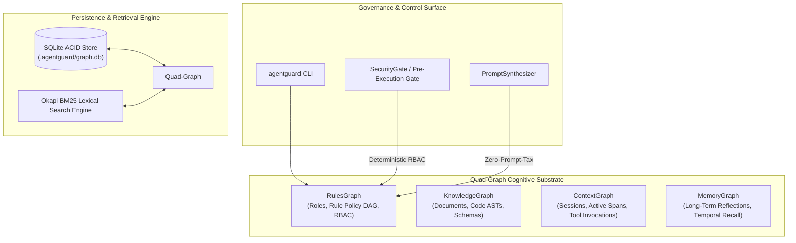

# AgentGuard System Architecture & Technical Specification

> **Author:** Bayly AI / AgentGuard Core Engineering Team  
> **Target Audience:** Systems Architects, Platform Engineers, Agent Developers  
> **Module Name:** `agentguard`  
> **Dependencies:** Standard Python Library (Zero External Dependencies)  

---

## 1. Architectural Overview

AgentGuard is a zero-dependency, standalone cognitive substrate and governance control plane designed for enterprise AI agent execution. It replaces unstructured markdown prompt dumps and probabilistic vector retrieval with a **Unified Quad-Graph Cognitive Substrate** backed by ACID SQLite storage.



---

## 2. Quad-Graph Plane Taxonomy

AgentGuard partitions all entity nodes and relational edges across four canonical planes:

```
                  +-----------------------------------+
                  |      Quad-Graph Substrate         |
                  +-----------------------------------+
                  |  RulesGraph      | KnowledgeGraph |
                  |  ContextGraph    | MemoryGraph    |
                  +-----------------------------------+
```

### 2.1. RulesGraph (`plane = "rules"`)
- **Node Types:** `agent_role`, `rule_policy`, `permission_scope`
- **Edge Types:** `GOVERNS`, `INHERITS_FROM`, `AUTHORIZES_TOOL`, `RESTRICTED_BY`
- **Lifecycle:** Static, version-controlled, deterministic.

### 2.2. KnowledgeGraph (`plane = "knowledge"`)
- **Node Types:** `document`, `code_module`, `code_class`, `code_function`, `schema`
- **Edge Types:** `references`, `contains_class`, `contains_function`, `depends_on`, `implements`
- **Lifecycle:** Static, reflecting repository structure and architecture specifications.

### 2.3. ContextGraph (`plane = "context"`)
- **Node Types:** `agent_instance`, `task_session`, `span`, `tool_invocation`
- **Edge Types:** `spawned_by`, `delegated_to`, `executed_tool`
- **Lifecycle:** Ephemeral, session-scoped execution traces.

### 2.4. MemoryGraph (`plane = "memory"`)
- **Node Types:** `fact`, `decision`, `reflection`, `episode`
- **Edge Types:** `ENFORCES`, `RESOLVES`, `SUPERSEDES`, `DERIVES_FROM`
- **Lifecycle:** Long-term temporal recall with bitemporal validities (`valid_from`, `valid_to`, `is_current`).

---

## 3. Rule Priority Hierarchy & Conflict Resolution Engine

Rules within the `RulesGraph` form a Directed Acyclic Graph (DAG) with four priority tiers:

$$\text{Tier 4: ORG\_INVARIANT} \succ \text{Tier 3: REPO\_STANDARD} \succ \text{Tier 2: SUBSYSTEM\_RULE} \succ \text{Tier 1: ROLE\_GUIDELINE}$$

```
+-------------------------------------------------------------------+
| Tier 4: ORG_INVARIANT   (e.g., No Direct Main Push, No DB Drop)   |
+-------------------------------------------------------------------+
                                  │ Dominates
                                  ▼
+-------------------------------------------------------------------+
| Tier 3: REPO_STANDARD   (e.g., TDD Discipline, Clean Build/Lint)  |
+-------------------------------------------------------------------+
                                  │ Dominates
                                  ▼
+-------------------------------------------------------------------+
| Tier 2: SUBSYSTEM_RULE  (e.g., API Backward Compatibility)        |
+-------------------------------------------------------------------+
                                  │ Dominates
                                  ▼
+-------------------------------------------------------------------+
| Tier 1: ROLE_GUIDELINE  (e.g., Concise Synthesis, Style Rules)    |
+-------------------------------------------------------------------+
```

### Deterministic Resolution Rules:
1. **Tier Dominance:** High-tier directives unconditionally override lower-tier directives.
2. **Same-Tier Collision Audit:** If two opposing directives (e.g. `allowed: action_x` vs `restricted: action_x`) exist at the *same* priority tier, the resolution engine raises `RuleConflictError` and halts execution before runtime side effects occur.
3. **Cycle Detection:** Role inheritance traversal uses DFS to detect cyclic dependencies (`role_a -> role_b -> role_a`). If a cycle is detected, `RuleCycleError` is raised immediately.

---

## 4. Okapi BM25 Lexical Search Math

For lexical retrieval across KnowledgeGraph, RulesGraph, and MemoryGraph nodes, AgentGuard implements the Okapi BM25 algorithm ($k_1 = 1.5, b = 0.75$):

$$\text{Score}(D, Q) = \sum_{i=1}^{n} \text{IDF}(q_i) \cdot \frac{f(q_i, D) \cdot (k_1 + 1)}{f(q_i, D) + k_1 \cdot \left(1 - b + b \cdot \frac{|D|}{\text{avgdl}}\right)}$$

Where:
- $f(q_i, D)$ is term frequency in node document $D$.
- $|D|$ is node token length, and $\text{avgdl}$ is average document token length across indexed nodes.
- $\text{IDF}(q_i) = \ln \left( \frac{N - n(q_i) + 0.5}{n(q_i) + 0.5} + 1 \right)$.

---

## 5. Persistence Engine (`agentguard/core/storage.py`)

AgentGuard uses standard library `sqlite3` with double-indexing (`idx_nodes_plane`, `idx_nodes_type`, `idx_edges_source`, `idx_edges_target`) and full transaction rollback safety (`with self._conn:`).
