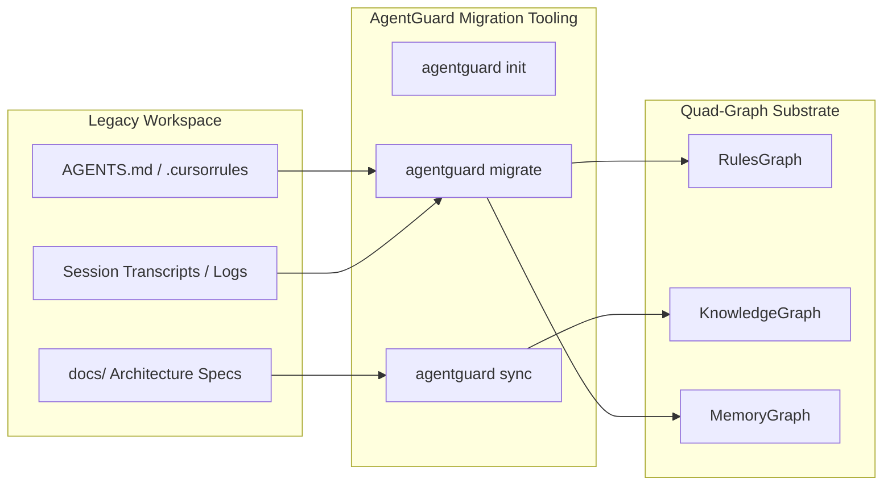

# Migration Guide: Moving from Unstructured AGENTS.md / RAG to AgentGuard

> **Target Audience:** Lead Engineers, DevOps Leads, Agent Harness Developers  
> **Scope:** Step-by-step transition from legacy prompt-stuffing to AgentGuard Quad-Graph Substrate  

---

## 1. Migration Overview

Legacy agent setups rely on unstructured `AGENTS.md` prompt dumps or vector search RAG pipelines. This guide details how to systematically migrate repository rules, documentation, and chat session histories into AgentGuard's Quad-Graph substrate.



---

## 2. Step-by-Step Migration Blueprint

### Step 1: Scaffold Repository Layout (`agentguard init`)
Run `agentguard init` at the root of your repository to establish `.agentguard/`, JSON rule directories, and default role definitions:

```bash
cd /path/to/your/repository
agentguard init
```

---

### Step 2: Migrate Legacy Rulebooks & Directives
AgentGuard automatically parses headers, `CR-*` governance directives, and rule blocks from existing `AGENTS.md` and `.cursorrules` files:

```bash
# Ingest legacy AGENTS.md into RulesGraph
agentguard migrate --from ./AGENTS.md
```

To break down monolithic markdown rules into clean, versioned JSON policies, extract high-priority constraints into `.agentguard/rules/10_org_invariants.json`:

```json
[
  {
    "id": "cr_org_legacy_001",
    "title": "Migrated Legacy Security Invariant",
    "priority": 4,
    "target_scope": "root",
    "restricted_actions": ["direct_git_push_main"],
    "content": "Original directive extracted from legacy AGENTS.md"
  }
]
```

---

### Step 3: Ingest Architecture Documents & AST Source Code
Run `agentguard sync` to parse your repository's `docs/` tree and Python AST source code into `KnowledgeGraph` nodes:

```bash
agentguard sync
```

---

### Step 4: Validate Graph Integrity (`agentguard validate`)
Verify that the migrated graph has zero inheritance cycles, no priority collisions, and no dangling references:

```bash
agentguard validate
```

If validation succeeds (`Graph Valid: True`), your repository is fully migrated to AgentGuard.

---

### Step 5: Replace System Prompt Dumps with Dynamic Synthesizer
Update your agent harness code to call `PromptSynthesizer.synthesize_prompt()` instead of reading raw `AGENTS.md` text files:

```python
# Legacy Code (Prompt Stuffing)
# system_prompt = open("AGENTS.md").read()

# Modern AgentGuard Code (Zero-Prompt-Tax)
from agentguard.core.graph import AgentGuardGraph
from agentguard.prompt.synthesizer import PromptSynthesizer

graph = AgentGuardGraph(db_path=".agentguard/graph.db")
graph.load_from_db()
system_prompt = PromptSynthesizer.synthesize_prompt(graph, role_id="developer")
```
