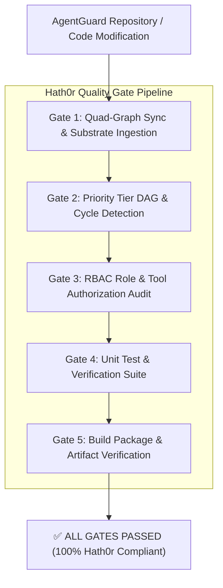

# Hath0r Agentic Framework Quality Gates & Compliance Standard

> **Specification:** Hath0r Quality Gate Specification  
> **Version:** 1.0.0  
> **Command Surface:** `agentguard quality-gate` or `agentguard check`  

---

## 1. Overview & Compliance Pattern

In accordance with the **Hath0r Agentic Framework**, all autonomous AI agent activity, repository commits, pull requests, and release distributions must pass through strict, deterministic **Quality Gates**. 

Quality Gates eliminate "probabilistic security drift" and ungrounded code generation by forcing every code modification through five non-bypassable verification checkpoints.



---

## 2. The 5 Quality Gates Detailed

### Gate 1: Quad-Graph Substrate Ingestion & Sync
- **Objective:** Re-scan all repository Markdown policy files (`AGENTS.md`, `.agentguard/rules/`), role manifests (`.agentguard/agents/`), architecture specifications (`docs/`), and Python AST source files into SQLite.
- **Verification Command:** `agentguard sync`
- **Failure Condition:** Unparseable syntax, missing files, or AST parse crashes.

---

### Gate 2: Priority Tier DAG & Cycle Audit
- **Objective:** Verify that the `RulesGraph` forms a valid Directed Acyclic Graph across priority tiers:
  $$\text{Tier 4: ORG\_INVARIANT} \succ \text{Tier 3: REPO\_STANDARD} \succ \text{Tier 2: SUBSYSTEM\_RULE} \succ \text{Tier 1: ROLE\_GUIDELINE}$$
- **Verification Command:** `agentguard validate`
- **Failure Condition:** Any cyclic role inheritance (`role_a -> role_b -> role_a`), same-tier rule priority collisions (`RuleConflictError`), or dangling node references.

---

### Gate 3: RBAC Role & Tool Authorization Audit
- **Objective:** Evaluate RBAC tool permissions across all registered agent roles (`architect`, `developer`, `reviewer`, `security`).
- **Verification Command:** `agentguard route --role <role_id>`
- **Failure Condition:** Undefined roles, conflicting forbidden/permitted tool assignments, or missing baseline permissions.

---

### Gate 4: Test-Driven Development (TDD) Verification
- **Objective:** Execute the full automated unit test suite.
- **Verification Command:** `python3 -m unittest discover tests`
- **Failure Condition:** Any unit test failure or unhandled exception.

---

### Gate 5: Evidence-Backed Release Packaging Gate
- **Objective:** Verify that the release build pipeline compiles standalone executable binaries, wheels, and source distributions into `./release/python/cli/`.
- **Verification Command:** `python3 scripts/build.py`
- **Failure Condition:** Build failures or missing release artifacts in `./release/python/cli/`.

---

## 3. Command Usage & Automation

### Developer Local Execution
To run all 5 Quality Gates locally before committing:

```bash
agentguard quality-gate
# or alias
agentguard check
```

### GitHub Actions CI/CD Integration
Automated in `.github/workflows/quality_gates.yml` and `.github/workflows/compliance.yml`.
